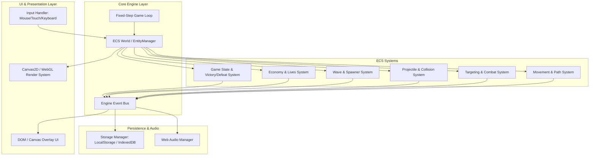

# System Design: Tower Defence Engine (v1)

## Overview
A web-based 2D Tower Defence game engine built with TypeScript, HTML5 Canvas / WebGL rendering, and a high-performance Entity Component System (ECS) architecture. The application simulates deterministic tick-based wave battles, tower placement grids, creep pathfinding, economy, and game state persistence using local storage (IndexedDB / LocalStorage).

---

## Goals & Non-Goals

### Goals (v1)
- **Deterministic ECS Game Loop**: Decouple game logic/simulation ticks (fixed 60 Hz) from rendering and user interaction.
- **Grid & Placement System**: Tile-based map supporting buildable zones, path zones, tower placement, range indicators, selection, and upgrade/sell actions.
- **Creep Navigation & Wave Spawning**: Wave manager with configurable spawn intervals, waypoint-based and grid pathfinding, creep health, speed, and rewards.
- **Tower Combat & Targeting**: Range detection, targeting strategies (*First*, *Lowest HP*, *Closest*), projectile simulation, and damage resolution.
- **Economy & Win/Loss Loop**: Gold economy (kill rewards, build/upgrade costs, sell refunds), player lives/core health, game over and victory conditions.
- **Local Persistence**: Save/load game progress, high scores, map unlock states, and user audio/display settings in the browser.

### Non-Goals (v1)
- Real-time multiplayer or online matchmaking.
- Server-side authoritative validation and cloud accounts (deferred to v2).
- Complex custom map editor / level sharing (deferred to v2).
- Dynamic custom particle shader systems or 3D rendering.

---

## Architecture Diagram



---

## Key Components

| Component | Responsibility | Technology |
|-----------|---------------|------------|
| **ECS World** | Manages entity IDs, component pools, system execution order, and queries. | TypeScript custom lightweight ECS or bitecs/miniplex |
| **Render System** | Interpolates entity transforms and renders sprite batches, towers, creeps, projectiles, range circles, and health bars. | HTML5 2D Canvas / WebGL (PixiJS or native Canvas2D) |
| **Grid & Map System** | Represents tile grid metadata (walkable, buildable, occupied), coordinates, and waypoint paths. | TypeScript 2D Array / Spatial Hash |
| **Wave Manager System** | Drives wave progression, spawn timings, enemy pool definitions, and wave intervals. | TypeScript ECS System |
| **Targeting & Combat System** | Evaluates tower attack cooldowns, finds targets in range by criteria (First, Weakest, Closest), spawns projectiles. | TypeScript ECS System |
| **Projectile System** | Moves ballistic and homing projectiles, computes hit detection, applies damage, and frees entities. | TypeScript ECS System |
| **Economy & Rules System** | Manages gold, base health, score multiplier, and evaluates win/loss states. | TypeScript ECS System |
| **Input & Placement Controller** | Handles pointer hovering, grid snapping, tower preview placement, upgrade/sell modals, and touch drag-and-drop. | Browser DOM / Pointer Events |
| **Storage Service** | Serializes high scores, unlocked maps, volume preferences, and checkpoint save states. | IndexedDB / localStorage |

---

## ECS Data Model & Components

### Core Components

```typescript
// Spatial & Physical
interface PositionComponent {
  x: number;
  y: number;
}

interface VelocityComponent {
  vx: number;
  vy: number;
  speed: number;
}

interface PathFollowerComponent {
  waypoints: { x: number; y: number }[];
  currentWaypointIndex: number;
  distanceTraveled: number;
}

// Combat & Creeps
interface HealthComponent {
  current: number;
  max: number;
}

interface CreepComponent {
  creepType: 'basic' | 'fast' | 'tank' | 'boss';
  bountyGold: number;
  damageToBase: number;
  scoreValue: number;
}

// Towers
interface TowerComponent {
  towerType: 'archer' | 'cannon' | 'mage';
  tier: number;
  range: number;
  fireRate: number; // Attacks per second
  cooldownRemaining: number;
  targetStrategy: 'first' | 'lowestHp' | 'closest';
  targetEntityId: number | null;
  baseCost: number;
}

// Projectiles
interface ProjectileComponent {
  damage: number;
  speed: number;
  targetEntityId: number;
  splashRadius: number;
}

// Renderable
interface SpriteComponent {
  spriteId: string;
  width: number;
  height: number;
  rotation: number;
  visible: boolean;
}
```

---

## Game Loop & Tick Lifecycle

1. **Input Phase**: Poll user interactions, queue placement, upgrade, or pause/speed toggle actions.
2. **Fixed Simulation Tick (60 Hz)**:
   - `WaveSystem`: Spawn enemies when timer triggers.
   - `MovementSystem`: Update creep positions along path waypoints. Check base breach.
   - `TargetingSystem`: Match idle/ready towers to valid creeps in range.
   - `CombatSystem`: Fire projectiles; decrement cooldowns.
   - `ProjectileSystem`: Move projectiles, check collisions, deal damage.
   - `CleanupSystem`: Recycle dead creeps, despawn expired projectiles, award gold & score.
   - `GameStateSystem`: Verify win/defeat conditions (Lives $\le 0$ or Waves cleared).
3. **Render Phase (requestAnimationFrame)**:
   - Calculate interpolation alpha ($\alpha = \text{accumulator} / \text{tickRate}$).
   - Clear canvas, draw map tiles and paths.
   - Draw towers, selection circles, and attack animations.
   - Draw creeps, smooth interpolated transforms, and health indicators.
   - Draw projectiles and hit effects.
   - Update UI overlay (Gold counter, Lives, Wave info).

---

## Persistence & Storage Schema

Data is stored locally under a structured schema:

```typescript
interface GameStorageSchema {
  version: 1;
  settings: {
    masterVolume: number;
    sfxVolume: number;
    bgmVolume: number;
    showRangeOnHover: boolean;
    gameSpeed: 1 | 2 | 4;
  };
  progress: {
    highScores: Record<string, number>; // mapId -> score
    completedLevels: string[];
    unlockedTowers: string[];
  };
  savedSession?: {
    mapId: string;
    currentWave: number;
    gold: number;
    lives: number;
    score: number;
    towers: Array<{
      type: string;
      tier: number;
      gridX: number;
      gridY: number;
    }>;
  };
}
```

---

## Error Handling & Performance Strategy

- **Object Pooling**: Pre-allocate entity slots and projectile components to prevent garbage collection pauses during high-density waves (e.g. 100+ creeps on screen).
- **Spatial Partitioning**: Spatial grid index for creep-tower distance lookups rather than $O(N \times M)$ pairwise checks.
- **Fail-Safe Game Loop**: Spiral-of-death protection on the fixed-step loop by capping maximum simulation ticks per animation frame (max 5 ticks per frame).
- **Graceful Storage Degradation**: Fall back to in-memory state if `localStorage`/`IndexedDB` is unavailable (e.g. strict private browsing mode).

---

## Open Questions & Roadmap to v2

1. **Audio Implementation**: Web Audio API synth vs pre-rendered audio sprite assets.
2. **v2 Features**: Particle FX pipeline, procedural wave modifiers, branching upgrade trees, and map editor.
