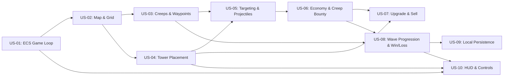

# Tower Defence Engine (v1) - User Stories Backlog

This backlog outlines the vertical slices required to build and deliver the **v1 Tower Defence Engine** as specified in [docs/architecture.md](architecture.md).

---

## Epic Overview: v1 Core Tower Defence Gameplay

The goal of v1 is to deliver a playable, deterministic, browser-based 2D Tower Defence game featuring grid-based tower placement, waypoint creep navigation, customizable targeting mechanics, economy loops, and local progress persistence.

---

### US-01: Deterministic ECS Core & Fixed Game Loop

**Title**: Implement Fixed-Step ECS Game Engine & Tick Loop

As a **game developer**,  
I want **a decoupled, fixed-step ECS simulation tick running alongside an interpolated render loop**,  
so that **game logic executes deterministically regardless of screen refresh rate or framerate drops**.

**Acceptance criteria**:
- Given the game engine is initialized, when running normally, then simulation systems update at a fixed 60 Hz tick interval ($16.67\text{ ms}$).
- Given variable rendering framerates (e.g., 30 FPS, 60 FPS, 120 FPS), when `requestAnimationFrame` fires, then visual positions interpolate smoothly between previous and current simulation states.
- Given the user pauses the game, when simulation ticks stop, then all entity state updates halt while the render loop continues drawing static scene states.
- Given the simulation falls behind by more than 5 ticks in a single render frame, when catching up, then the accumulator caps to avoid spiral-of-death execution lockup.
- Given 1x, 2x, and 4x speed modifiers, when the user toggles simulation speed, then tick frequency scales proportionally without corrupting physics or cooldown math.

**Dependencies**:
- None

**Out of scope**:
- Multithreaded Web Workers for simulation offloading.

**Open questions**:
- None

---

### US-02: Map Tile Grid & Buildable Zones

**Title**: Render Tile Map with Buildable Zones and Path Tiles

As a **player**,  
I want **to see a clear 2D grid distinguishing walkable creep paths from buildable tower tiles**,  
so that **I can understand where enemies will travel and where I can place defenses**.

**Acceptance criteria**:
- Given a loaded level configuration, when the map renders, then path tiles, buildable ground tiles, and blocked obstacle tiles are visually distinct.
- Given the player moves their pointer over the map, when hovering over any valid tile, then a cursor highlight snaps to the matching grid coordinate $(x, y)$.
- Given an obstacle or path tile, when the player hovers over it, then visual indicators reflect that tower construction is prohibited on that coordinate.
- Given different browser viewport dimensions, when resizing the window, then the canvas maintains the fixed map aspect ratio without clipping tiles.

**Dependencies**:
- [US-01: Deterministic ECS Core & Fixed Game Loop](#us-01-deterministic-ecs-core--fixed-game-loop)

**Out of scope**:
- In-game dynamic map tile terrain destruction or tile painting editor.

**Open questions**:
- None

---

### US-03: Creep Spawning & Waypoint Navigation

**Title**: Spawn Creep Waves with Waypoint Path Navigation

As a **player**,  
I want **waves of enemy creeps to spawn at the entrance and march along path waypoints toward my base**,  
so that **I have moving targets to defend against**.

**Acceptance criteria**:
- Given an active wave, when enemy spawn intervals elapse, then creeps spawn at the defined entrance waypoint with designated HP, speed, and bounty values.
- Given an active creep on the map, when it advances, then it moves smoothly along the ordered sequence of path waypoints toward the exit base.
- Given a creep reaches the final base waypoint, when it breaches the base, then the player's core lives decrease by the creep's damage value and the creep entity is removed from the world.
- Given a creep is damaged but still alive, when it moves, then an overhead health bar visually reflects its remaining health percentage.

**Dependencies**:
- [US-01: Deterministic ECS Core & Fixed Game Loop](#us-01-deterministic-ecs-core--fixed-game-loop)
- [US-02: Map Tile Grid & Buildable Zones](#us-02-map-tile-grid--buildable-zones)

**Out of scope**:
- Dynamic obstacle-avoidance A* recalculation (paths are predetermined waypoints in v1).
- Flying units that bypass path tiles.

**Open questions**:
- None

---

### US-04: Tower Placement, Range Preview & Grid Snapping

**Title**: Tower Selection, Range Preview, and Grid Placement

As a **player**,  
I want **to select a tower from the build menu, preview its attack range, and place it on valid grid tiles**,  
so that **I can strategically position my defenses using my available gold**.

**Acceptance criteria**:
- Given sufficient gold, when the player selects a tower from the build menu, then a placement ghost with an attack range circle follows the cursor.
- Given the cursor is over an unoccupied buildable tile, when clicking to build, then gold is deducted, the tower entity is created at that grid coordinate, and the tile is marked as occupied.
- Given insufficient gold or an invalid tile (occupied tile, path tile, or obstacle), when the player attempts placement, then the placement is rejected with visual feedback and gold is not deducted.
- Given an active placement preview, when the player presses Escape or clicks the cancel button, then the build mode cancels without spending gold.

**Dependencies**:
- [US-02: Map Tile Grid & Buildable Zones](#us-02-map-tile-grid--buildable-zones)

**Out of scope**:
- Placing towers that alter or block creep pathfinding.

**Open questions**:
- None

---

### US-05: Tower Targeting & Projectile Combat System

**Title**: Tower Targeting Heuristics and Projectile Combat

As a **player**,  
I want **towers to detect creeps within range, prioritize targets, and fire projectiles**,  
so that **my defenses actively attack and destroy incoming waves**.

**Acceptance criteria**:
- Given creeps within a tower's attack radius, when the tower attack cooldown reaches zero, then the tower identifies a target according to its configured targeting strategy (*First*, *Lowest HP*, or *Closest*).
- Given a target is locked, when the tower fires, then a projectile entity spawns moving toward the target position or tracking the target entity.
- Given a projectile collides with or reaches its target, when impact occurs, then damage is applied to the target's health component and the projectile is despawned.
- Given a projectile with area-of-effect (splash) damage, when it impacts, then all creeps within the splash radius receive damage scaled by distance.
- Given the player selects a placed tower, when clicking the target mode toggle, then the tower cycles through targeting priorities (*First* $\rightarrow$ *Lowest HP* $\rightarrow$ *Closest*).

**Dependencies**:
- [US-03: Creep Spawning & Waypoint Navigation](#us-03-creep-spawning--waypoint-navigation)
- [US-04: Tower Placement, Range Preview & Grid Snapping](#us-04-tower-placement-range-preview--grid-snapping)

**Out of scope**:
- Beam weapons with continuous raycast ticks (v1 uses discrete projectiles).

**Open questions**:
- None

---

### US-06: Creep Death, Gold Economy & Score System

**Title**: Creep Bounty Economy and Score Tracking

As a **player**,  
I want **to earn gold and score points whenever creeps are destroyed by my towers**,  
so that **I can fund further defenses and measure my game performance**.

**Acceptance criteria**:
- Given a creep whose health reaches zero or below, when the cleanup system processes the entity, then the creep is removed from the world, a death particle/animation triggers, and the creep's bounty gold is added to the player balance.
- Given a defeated creep, when bounty is awarded, then player total score increases based on the creep's point value multiplied by current difficulty/speed multipliers.
- Given an update to gold or score, when the event fires, then the player HUD immediately displays the updated values.

**Dependencies**:
- [US-05: Tower Targeting & Projectile Combat System](#us-05-tower-targeting--projectile-combat-system)

**Out of scope**:
- Interest/bank dividend mechanics on unspent gold.

**Open questions**:
- None

---

### US-07: Tower Upgrade & Sell Lifecycle

**Title**: Inspect, Upgrade, and Sell Placed Towers

As a **player**,  
I want **to select placed towers to upgrade their stats or sell them for a partial gold refund**,  
so that **I can adapt my strategy to stronger enemy waves and recover funds from misplaced towers**.

**Acceptance criteria**:
- Given an existing placed tower, when the player clicks it, then the tower selection panel displays its current stats (damage, range, fire rate, tier) and an upgrade/sell menu.
- Given sufficient gold and a tower below maximum tier, when the player confirms an upgrade, then the upgrade cost is deducted, the tower tier increments, and its damage/range/fire rate stats increase according to definition data.
- Given a selected tower, when the player chooses to sell, then a partial refund (e.g., 70% of total invested gold) is credited to player gold, the tower entity is removed, and the tile is freed for new construction.
- Given an active selection, when the player clicks empty ground or another tower, then the selection panel updates or closes appropriately.

**Dependencies**:
- [US-04: Tower Placement, Range Preview & Grid Snapping](#us-04-tower-placement-range-preview--grid-snapping)
- [US-06: Creep Death, Gold Economy & Score System](#us-06-creep-death-gold-economy--score-system)

**Out of scope**:
- Branching non-linear tech trees (v1 uses linear Tier 1 $\rightarrow$ Tier 2 $\rightarrow$ Tier 3 upgrades).

**Open questions**:
- None

---

### US-08: Wave Progression & Win/Loss Game State

**Title**: Wave Progression, Victory, and Game Over State Machine

As a **player**,  
I want **clear wave start triggers, wave countdowns, and distinct Victory / Game Over screens**,  
so that **I can track level progress and experience rewarding game loops**.

**Acceptance criteria**:
- Given the preparation phase, when the player clicks "Start Wave" or the auto-start timer reaches zero, then the next wave begins spawning enemies.
- Given all creeps in the final wave of a level are destroyed and the player has at least 1 life remaining, when wave evaluation runs, then a Victory modal appears showing final score, waves survived, and options to replay or return to menu.
- Given the player's core lives reach zero, when base damage resolves, then the simulation halts immediately and a Game Over screen appears displaying stats and a Retry button.
- Given the player clicks "Restart Level" on either screen, when triggered, then gold, lives, map grid, and wave state reset cleanly to level start conditions.

**Dependencies**:
- [US-03: Creep Spawning & Waypoint Navigation](#us-03-creep-spawning--waypoint-navigation)
- [US-06: Creep Death, Gold Economy & Score System](#us-06-creep-death-gold-economy--score-system)

**Out of scope**:
- Endless procedural wave generation mode (v1 uses fixed scripted wave definitions per map).

**Open questions**:
- None

---

### US-09: Local Storage Persistence & Player Settings

**Title**: Persist High Scores, Level Unlocks, and Settings Locally

As a **player**,  
I want **my high scores, unlocked maps, and audio/speed preferences saved in my browser**,  
so that **my game progress is remembered across browser sessions without needing an account**.

**Acceptance criteria**:
- Given a completed level, when the victory state triggers, then the new high score and unlocked map progression flags are written to `localStorage` under the versioned schema.
- Given adjusted user settings (master volume, SFX volume, game speed preference, range indicator toggles), when changed, then values are saved and restored on next application launch.
- Given a user launches the game in private/incognito browsing where storage may throw security exceptions, when saving fails, then the storage service falls back to in-memory state without crashing the game loop.
- Given corrupted or invalid stored JSON schema data, when parsing on startup, then default fallback state is safely initialized.

**Dependencies**:
- [US-08: Wave Progression & Win/Loss Game State](#us-08-wave-progression--win-loss-game-state)

**Out of scope**:
- Cloud save synchronization or cross-device account authentication.

**Open questions**:
- None

---

### US-10: Player HUD & Canvas Responsive Layout

**Title**: Player HUD, Build Toolbar, and Responsive Controls

As a **player**,  
I want **an intuitive heads-up display (HUD) showing gold, lives, wave info, and tower build buttons**,  
so that **I can monitor my status and interact with game controls on desktop and mobile browsers**.

**Acceptance criteria**:
- Given active gameplay, when rendering the UI overlay, then current Gold, Lives, Score, Current/Total Wave, and Game Speed are clearly displayed and updated in real time.
- Given the build bar, when rendered, then available tower types show their icon, name, and gold cost, with disabled visual states when affordable funds are insufficient.
- Given keyboard inputs, when pressing hotkeys (e.g., Space for Pause/Resume, 1-3 for Tower Selection, 1-3 for Speed Toggle), then the corresponding actions trigger immediately.
- Given touch screen or mouse pointer interactions, when tapping tower buttons and tiles, then touch targets are at least $44 \times 44\text{ px}$ and responsive without accidental double-tap zooming.

**Dependencies**:
- [US-01: Deterministic ECS Core & Fixed Game Loop](#us-01-deterministic-ecs-core--fixed-game-loop)
- [US-04: Tower Placement, Range Preview & Grid Snapping](#us-04-tower-placement-range-preview--grid-snapping)
- [US-08: Wave Progression & Win/Loss Game State](#us-08-wave-progression--win-loss-game-state)

**Out of scope**:
- Custom HUD skinning / theme customization.

**Open questions**:
- None

---

## Suggested Implementation Sequence

